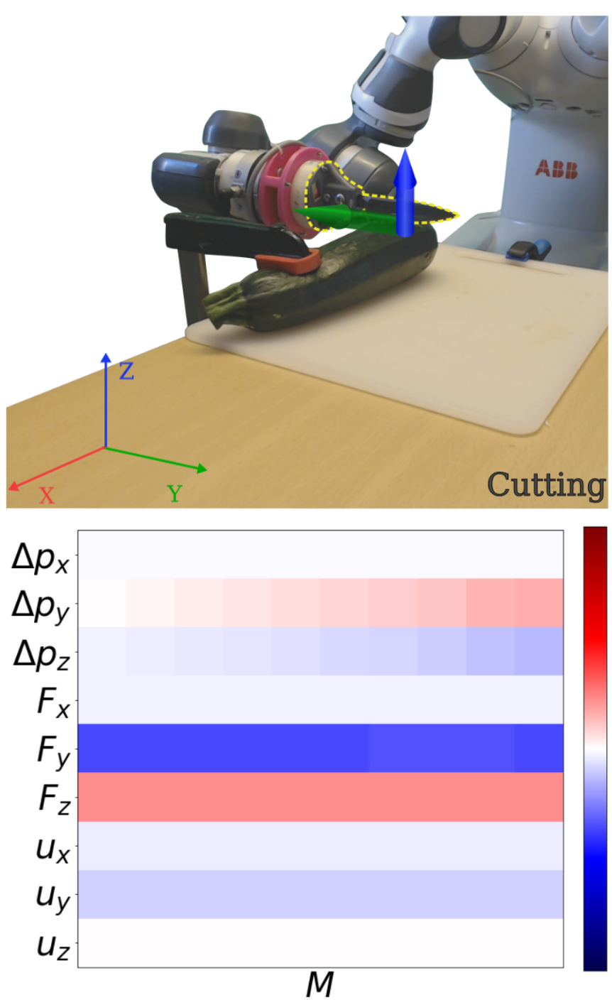
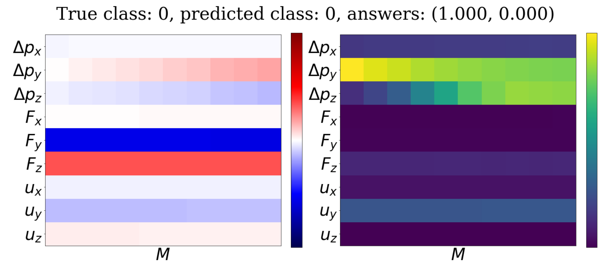
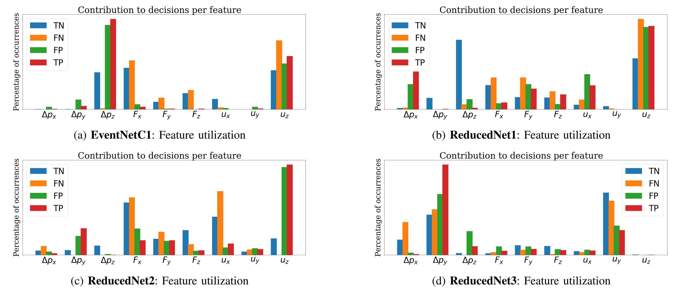

# Interpetability in Contact-Rich Manipulation Tasks via Kinodynamic Images
**Link to manuscript coming soon**.

Deep Neural Networks (NNs) have been widely utilized in contact-rich manipulation tasks to model the complicated contact dynamics. However, NN-based models are often difficult to decipher which can lead to seemingly inexplicable behaviors and unidentifiable failure cases. In this work, we address the interpretability of NN-based models by introducing the kinodynamic images.
We propose a methodology that creates images from the kinematic and dynamic data of a contact-rich manipulation task. Our formulation visually reflects the task's state by encoding its kinodynamic variations and temporal evolution, for example during cutting:

<center>

</center>


By using images as the state representation, we enable the application of interpretability modules that were previously limited to vision-based tasks. We use this representation to train Convolution-based Networks and we extract interpretations of the model's decisions with
<a href="http://gradcam.cloudcv.org/">Grad-CAM </a>, a technique that produces visual explanations:

<center>

</center>

Tasks with different dimensions or types of features can be accommodated simply by modifying what comprises the height of the image. In addition, multi-label classification can be treated exactly in the same manner as Grad-CAM is not constrained by the number of classes.
<a href="https://github.com/imitsioni/interpretable_manipulation/tree/master/scripts/dataset_handlers">_(See argument `multi_class` in  class `TXTImporter()`)_</a>

In our experiments we showed how to detect features that lead to miss-classifications by inspecting isolated sequences during label transitions. Furthermore, we showed how interpretability can help distinguish models that are seemingly identical based on their learning scores but will behave differently during deployment. Lastly, we illustrated how the same pipeline can be used to derive quantitative results about feature utilization and how that can be applied to examine the model's generalization abilities.
<a href="https://github.com/imitsioni/interpretable_manipulation/blob/master/scripts/Visualizing.ipynb"> _(See examples in `Visualizing.ipynb` )_</a>.

However, this method is versatile and can be used for more tasks. For instance, if there is a large network that has good performance, we can use this method to elaborate on the characteristics of its decisions. Then, we can iteratively reduce the size and evaluate models until we find one that exhibits the same characteristics as the original one and is acceptably small.

As an example, we can evaluate 4 different models to examine how the trend changes depending on their size.

    - EventNetC1 has 3 convolutional layers, (32,64,128) channels, (1,5), (1,3), (1,1) filters)
    - ReducedNet1 has the same layer number but half the channels (16,32,64)
    - ReducedNet2 is the same as the original but without the last convolutional layer
    - ReducedNet3 has only the first layer with 16 channels and a (1,5) filter

<center>

</center>

From this figure, we can see that the first network relies heavily on

with a few FN and FP on . ReducedNet1 maintains a strong focus on  but starts using the other features as well. ReducedNet2 has almost an equal amount of FP and TP on  and bases most of the Negative results on , which is not very indicative of the task. Lastly, the smallest network ReducedNet3 completely shifts the pattern and is mostly using .

# Code Structure and Details
- The code for training and evaluation is in `scripts/`.
- Datasets from the cutting task are placed in `data/cutting_datasets`.

## Installing dependencies  
```bash
virtualenv interp_event_detection_env --python=python3 # Or use preferred env creation method
cd interpretable_manip_env && source bin/activate # Activate env
pip3 install numpy matplotlib scikit-learn joblib jupyter torch torchvision opencv-python # Dependencies
```

## Training
All models were trained to minimize Cross Entropy and use Adam as an optimizer.
To train a convolutional model to be used for evaluation, run the script `train.py`. To train a new Convolutional LSTM model, run `trainCLSTM.py`. Usage is as follows:

`train.py --modelName` {file name to save model as}

or

`trainCLSTM.py --modelName` {file name to save model as}

Further arguments can be given to overwrite the default values that were used in the presented work:

    --train_path : path to training data (default  ../data/cutting_datasets/train)

    --test_path : path to test data (default ../data/cutting_datasets/test),

    --horizon : How many blocks ahead class label refers to (default 3)

    --block_size : 1Length M of the sequence comprising each block. (default 10)

    --scale_pixels : upscaling factor for input representation (default 1)

    --colormap : colormap to be used for input rendering (default "seismic")

    --epochs : epochs to run training (default 25)

    --learning_rate : initial learning rate (default 1e-03)

    --batch_size : batch size used for training (default 32)

    --num_workers : number of worker threads used for training (default 2)

    --model_name : file name to save model as, used to load later for evaluation

## Evaluation
To view the visually interperatable outputs, and conduct the feature importance evaluation, run the `Visualizing.ipynb` notebook for CNN models, or use `VisualizingCLSTM.ipynb`for C-LSTM models. The same default arguments as above can be changed in the first cell, as well as where and if figures should be saved.


# Additional Notes
## Colormap choice
The colormap choice can affect the training results for the CNN and needs to be chosen accordingly. For a task with specific directionality, e.g. the pushing task that transpires only on one motion axis and all the quantities can have the same sign, sequential colormaps are appropriate.
However, in other cases, the features can take both positive and negative values that lead to different dynamic patterns, making diverging colormaps more fitting.
During training, we observed that the color chosen to represent the neutral zone of the scaled features can bias the network and lead to significantly different results.
## Data collection
During data collection the commanded trajectories always ended with zero velocities for stability issues. For this specific problem formulation, these sequences were kept in the dataset and unavoidably annotated as part of the negative class C = 1. Depending on the actual application of the event detection module, this is not always advisable. In the case that the event triggers a reaction from the system, these points should be annotated differently, e.g. with an additional clause for the control input level that will differentiate them.
